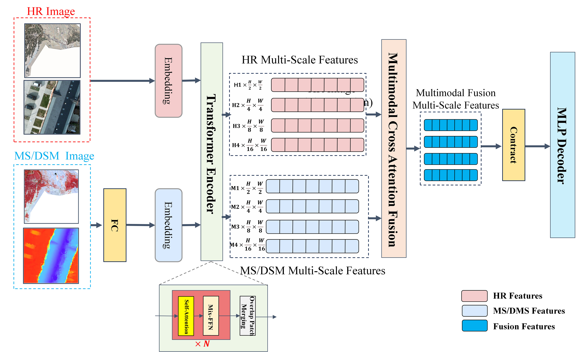
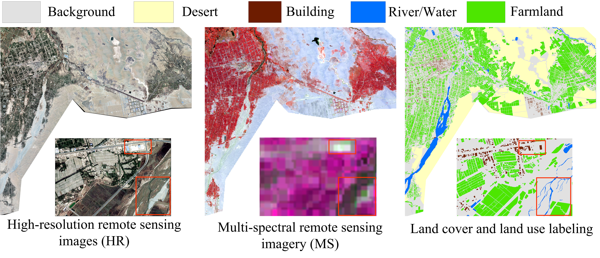
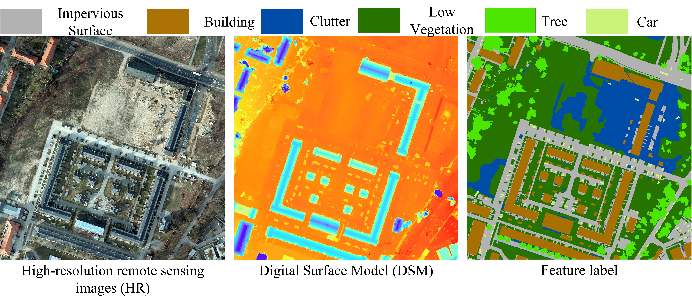
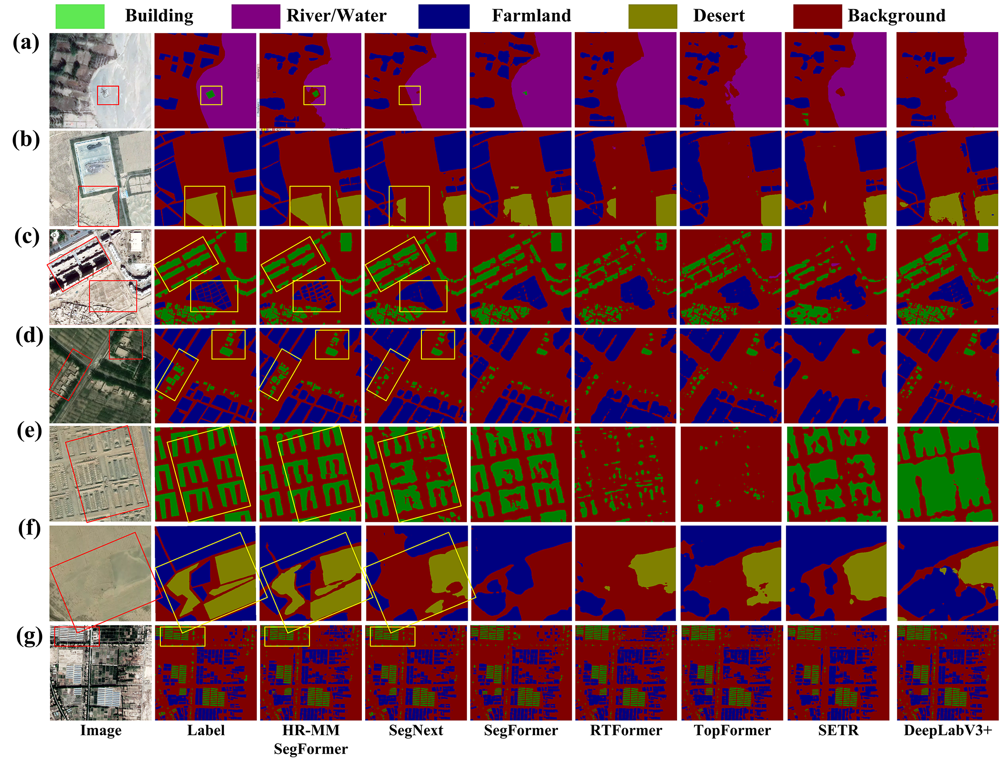

## Overview


 MS-HR SegFormer a generic Transformer-based semantic segmentation framework, termed HR-MM SegFormer (Fig.1), which integrates HR optical remote sensing data and multimodal (multi-source) data. The framework employs a unified Vision Transformer to extract multi-scale features from both HR and MM data and performs cross-attention fusion to fully exploit the complementary and discriminative characteristics of the same geographic scene, thereby addressing the limitations of single-source remote sensing image semantic segmentation.    

## Dataset
[talimu-Multispectral datasets](https://drive.google.com/drive/folders/19kzW_Ray2gQy9Q6M6UZvkb4Rwxoeymdt?usp=drive_link)


[Postdam-DSM datasets](https://drive.google.com/drive/folders/1yy-sMVo48hoezj-PMYYz2dyzjnyV5oao?usp=drive_link) and [Vinmate-DSM datasets](https://drive.google.com/drive/folders/1JIdKtDLNHcCOpMfIgDq3rX31KB_0J3Bv?usp=drive_link)

## Environments
Experiment environments
```bash
python>=3.10
ubuntu 22.04
```
Create development environment
* Install Paddle: https://github.com/PaddlePaddle/PaddleSeg/tree/release/2.8.1

```bash
pip install requirements.txt
```


Train/Predict

```bash
#  train model
python tools/train.py --config configs/quick_start/segformer.yml --save_interval 5000 --do_eval --use_vdl --save_dir output --resume_model output/iter_300000
#  Split Datasets
python tools/data/split_dataset_list.py ./dataset/ images images2 labels --split 0.6 0.2 0.2 --format tif tif tif
# Val model
python tools/val.py --config  configs/quick_start/segformer.yml --model_path output_1head/best_model/model.pdparams
# predict model
python tools/predict.py --config configs/quick_start/segformer.yml --model_path output/best_model/model.pdparams --image_path dataset/Dataset.txt   --save_dir output/result
```

## License

This project is licensed under the MIT License - see the [LICENSE](LICENSE) file for details.


## Result



